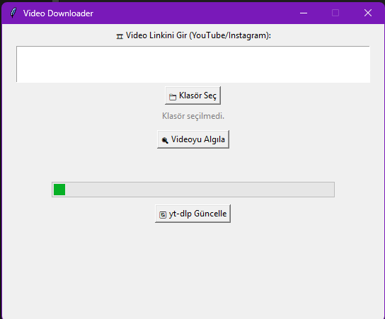

# 🎬 Reels Downloader

Bu uygulama, Instagram, YouTube ve TikTok gibi platformlardan video indirmek için yapılmış bir masaüstü uygulamasıdır. Kullanıcı dostu bir arayüz sunar ve MP4 veya MP3 formatında medya indirmenize olanak tanır.

## 🚀 Özellikler

- ✅ Link yapıştırarak medya tespiti
- ✅ MP3 / MP4 format seçimi
- ✅ Instagram, YouTube ve TikTok desteği
- ✅ Kalite seçimi (YouTube videoları için)
- ✅ Thumbnail önizleme ve video bilgileri
- ✅ ffmpeg ile sesli videoları birleştirme

## 🧠 Geliştirme Amacı

> Bu proje tamamen **kişisel öğrenim** amacıyla geliştirilmiştir. Herhangi bir ticari ya da lisanssız dağıtım amacı **taşımamaktadır**.

## ⚖️ Yasal Uyarı

- Bu araç, kullanıcıya ait hesaplardan indirilen **kamuya açık içerikler** içindir.
- Telif hakkı içeren videoların izinsiz olarak indirilmesi **kullanıcının sorumluluğundadır.**
- Bu uygulama, Instagram, YouTube veya TikTok ile **bağlantılı değildir**.
- Bu nedenle projemdeki bir çok dosyayı ve setup'ı dahil etmedim repository'e.

## 🛠️ Kullanılan Teknolojiler

- Python
- tkinter
- yt-dlp
- ffmpeg
- Pillow (thumbnail için)

## 📸 Görseller

| Arayüz | Önizleme |
|-------|----------|
|  | Video bilgileri ve indirme seçenekleri gösterilir. |
